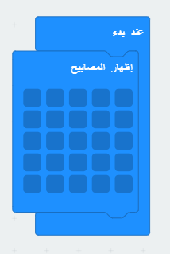
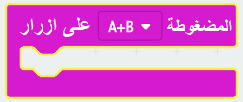
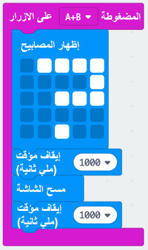

## الضغط على الأزرار معا

لنبدأ برنامجك عندما تضغط على زر A و زر B معاً.

+ اذهب إلى<a href="https://rpf.io/microbit-new" target="_blank">rpf.io/microbit-new </a> للبدأ بمشروع جديد في محرر إنشاء الكودات (PXT)MakeCode. سمِّ مشروعك الجديد 'قيّم زملائك'.

+ عند بدء تشغيل micro: bit ، اعرض صورة توضح أنه يجب الضغط على الزرين.

يمكنك استخدام نص التمرير بدلاً من صورة إذا كنت تفضل ذلك.

+ لا يجب إظهار التقييم حتى **يتم الضغط على الزر**. إضافة حدث جديد `على الزر A+B اضغط` إلى مشروعك.

+ أضف رمزًا لإظهار علامة استفهام لمدة ثانية واحدة ، لبناء التشويق قبل إعطاء الأصدقاء تقييمهم.

+ اختبر الرمز الخاص بك. عند الضغط على الأزرار **A و B معًا** ، علامة الاستفهام يجب أن تُومض على الشاشة.

