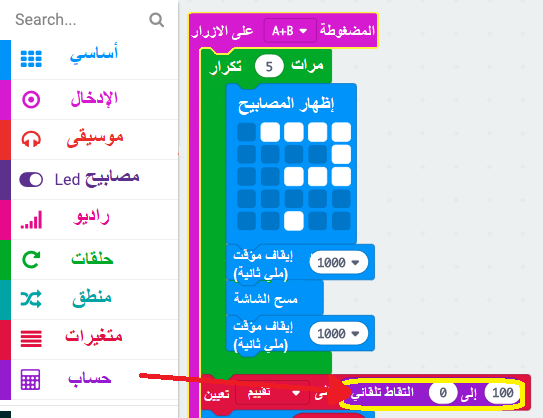

## عرض التقييم

عرض تقييم الصداقة على الشاشة.

+ اضغط على"المتغيرات" وقم بعمل متغير حديد يسمى `تصنيف`.

+ اسحب الكتلة `تعيين` إلى نهاية `على الزر A+B مضغوط` وحدد متغير `تقييم`:

+ اضغط فوق 'حساب'، واستخدم `اختيار عشوائي` مجموعة لضبط التقييم لرقم عشوائي بين ٠ و ١٠٠.

+ أضف تعليمة برمجية لإظهار التقييم على الشاشة.

+ أخيرًا ، بعد التأخير ، اعرض التعليمات مرة أخرى. تذكر أنه يمكنك استخدام النقر بزر الفأرة الأيمن ثم "تكرار" لنسخ مجموعة.

+ اختبر مشروعك. الآن ، إذا ضغطت على الزرين A و B معًا ، سيتم عرض تصنيف عشوائي.