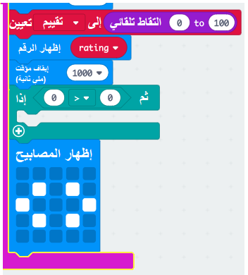
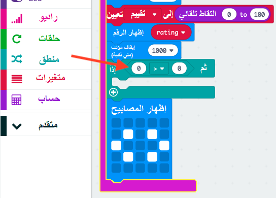
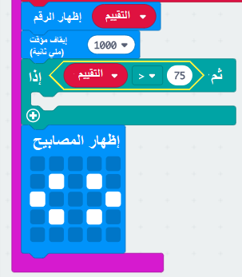
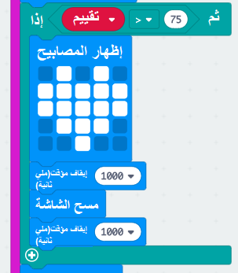

## أفضل الأصحاب

لنضع قلب عندما يكون هناك تقييم عالي لصديقين.

+ أضف ` إذا ` منع رمزك ، قبل عرض التعليمات مباشرة.

+ تريد عرض قلب إذا كان التقييم عاليا (قل أكثر من 75). للقيام بذلك، اسحب كتلة مقارنة من "المنطق" إلى "إذا" وحدد ">":

+ اسحب متغير `تقييم ` إلى الجانب الأيسر من كتلة `إذا` وأضف الرقم `75` إلى الجانب الأيمن.

أي شفرة داخل هذا الكود سيتم تشغيلها اذا كان التقييم اكثر من 75.

+ ضع صورة قلب على الشاشة لمدة ثانية واحدة اذا كان التقييم اكثر من 75.

+ اختبر مشروعك. هل تظهر صورة القلب اذا كان التقييم اكثر من 75؟ قد تضطر الى المحاولة عدة مرات لاختباره!