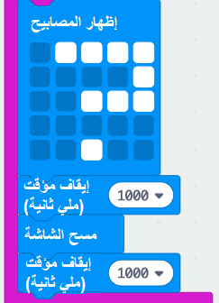
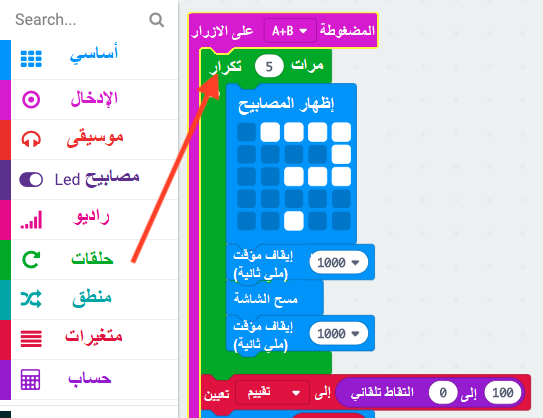

## أضافة رسوم متحركة

لنعرض رسوم متحركة قصيرة في برنامجك.

+ إليك التعليمات البرمجية لعرض علامة استفهام لمدة ثانية واحدة قبل مسح الشاشة:

+ لجعل علامة الاستفهام هذه فلاش 5 مرات، ستحتاج إلى وضع هذا الرمز داخل حلقة `كرر` وتعيين عدد التكرار إلى '5':

