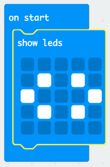

## Pwyso botymau gyda'i gilydd

Gadewch i ni ddechrau eich rhaglen pan fydd y botymau A a B yn cael eu pwyso gyda'i gilydd.

+ Ewch i <a href="http://jumpto.cc/pxt-new" target="_blank">jumpto.cc/pxt-new</a> i ddechrau prosiect newydd yn y golygydd MakeCode (PXT). Galwch eich prosiect newydd yn 'Graddio Eich Ffrindiau'.

+ Pan fydd y micro:bit yn dechrau, dangoswch ddelwedd sy'n dangos y dylid pwyso'r ddau fotwm.

Gallwch ddefnyddio sgrolio testun yn lle delwedd os yw'n well gennych.

+ Ni ddylid dangos gradd hyd nes y bydd **y ddau fotwm yn cael eu pwyso**. Ychwanegwch ddigwyddiad `on button A+B pressed` (pan wasgir botwm A + B) newydd i'ch prosiect.

+ Ychwanegwch god i ddangos marc cwestiwn am 1 eiliad, i adeiladu'r cyffro cyn rhoi eu gradd i'r ffrindiau.

+ Rhowch brawf ar eich cod. Pan fyddwch yn pwyso botymau **A a B gyda'i gilydd**, dylai marc cwestiwn fflachio ar y sgrin.

