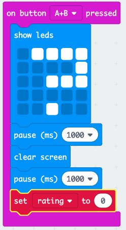
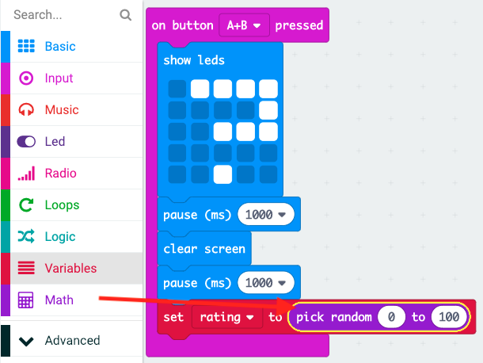

## Dangos gradd

Dangos gradd cyfeillgarwch ar y sgrin.

+ Cliciwch 'Variables' (Newidynnau) a gwnewch newidyn newydd o'r enw `gradd`.

+ Llusgwch floc `set` (gosod) i ddwedd eich cod `on button A+B pressed` (pan wasgir botwm A+B) a dewiswch y newidyn `gradd`:

+ Cliciwch 'Math', a defnyddiwch y bloc `pick random` (dewis ar hap) i osod y radd i rif hap rhwng 0 a 100.

+ Ychwanegwch god i ddangos y radd ar y sgrin.

+ Yn olaf, ar ôl oedi, dangoswch y cyfarwyddiadau eto. Cofiwch y gallwch chi ddefnyddio'r clicio ar y dde yna 'Duplicate' (Dyblygu) i gopïo bloc.

+ Rhowch brawf ar eich cod. Nawr, os ydych chi'n pwyso botymau A a B gyda'i gilydd, dylid arddangos gradd hap.