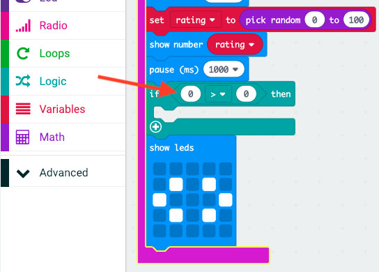

## Ffrindiau gorau

Gadewch i ni arddangos calon pan fydd gan ddau ffrind radd uchel.

+ Ychwanegwch floc `if` (os) i'ch cod, cyn i'r cyfarwyddiadau gael eu dangos.

+ Rydych chi'n dymuno arddangos calon os yw'r radd yn uchel (dywedwch dros 75). I wneud hyn, llusgwch floc cymhariaeth o 'Logic' i'ch 'if' (os) a dewiswch '>':

+ Llusgwch eich newidyn `rating` (sgôr) i ochr chwith eich bloc `if` (os), ac ychwanegu rhif `75` i'r ochr dde.

Bydd unrhyw god y tu mewn i'r bloc `if` (os) hwn yn rhedeg os yw'r sgôr dros 75.

+ Dangoswch ddelwedd calon ar y sgrin am 1 eiliad os yw'r radd dros 75.

+ Rhowch brawf ar eich cod. A oes delwedd o galon yn ymddangos os yw'r radd dros 75? Gallai fod rhaid i chi roi ychydig gynigion arni i'w brofi!