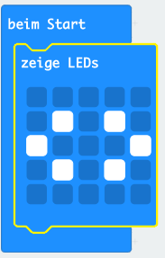
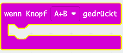
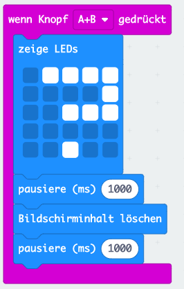

## Tasten gleichzeitig drücken

Lass dein Programm starten, wenn die Tasten A und B gleichzeitig gedrückt werden.

+ Rufe <a href="https://rpf.io/microbit-new" target="_blank">rpf.io/microbit-new</a> auf, um ein neues Projekt im MakeCode (PXT)-Editor zu starten. Nenne dein neues Projekt "Bewerte deine Freunde".

+ Wenn das micro:bit startet, zeige ein Bild an, das zeigt, dass beide Tasten gedrückt werden sollten.

Du kannst, wenn du möchtest, anstelle eines Bildes auch einen Bildlauftext verwenden.

+ Eine Bewertung sollte erst angezeigt werden, wenn **beide Tasten** gedrückt werden. Füge deinem Projekt ein neues `auf Schaltfläche A+B drücken` Ereignis hinzu.

+ Füge Code hinzu, um 1 Sekunde lang ein Fragezeichen anzuzeigen und die Spannung aufzubauen, bevor du den Freunden ihre Bewertung gibst.

+ Teste deinen Code. Wenn du die Tasten **A und B gleichzeitig**drückst, sollte ein Fragezeichen auf dem Bildschirm blinken.

