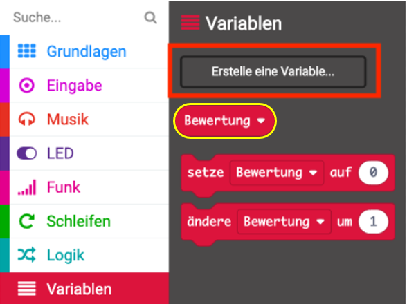
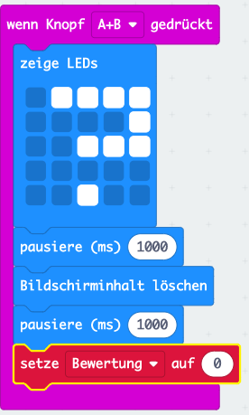
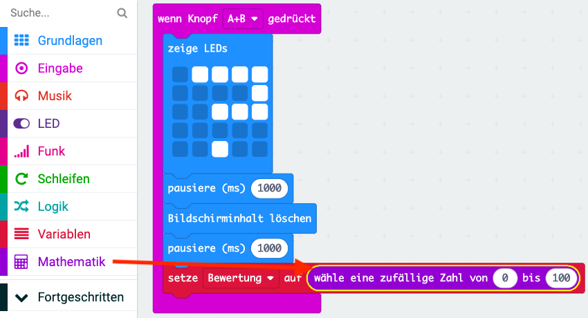
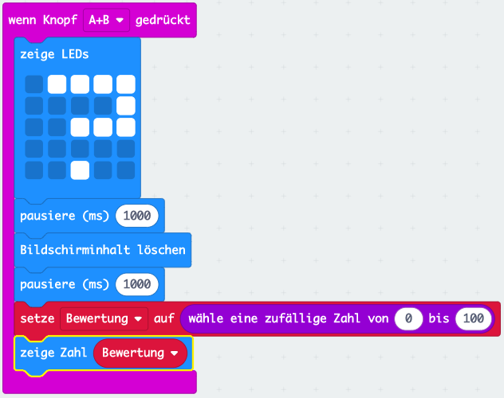
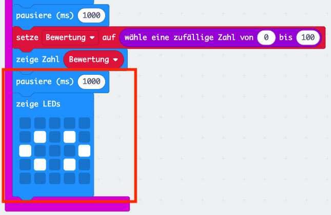

## Eine Bewertung anzeigen

Zeige eine Freundschaftsbewertung auf dem Bildschirm an.

+ Klicke auf 'Variablen' und erstelle eine neue Variable mit dem Namen `Bewertung`.

+ Ziehe einen `Setze`-Block an das Ende deines `auf Taste A+B drücken`-Code und wähle die Variable `Bewertung`:

+ Klicke auf 'Mathematik' und verwende den `wähle ein zufällige Zahl`-Block, um die Bewertung auf eine Zufallszahl zwischen 0 und 100 festzulegen.

+ Füge Code hinzu, um die Bewertung auf dem Bildschirm anzuzeigen.

+ Zeige nach einer Verzögerung die Anweisungen erneut an. Denke daran, dass du mit der rechten Maustaste und dann auf 'Duplizieren' einen Block kopieren kannst.

+ Teste deinen Code. Wenn du nun die Tasten A und B gleichzeitig drückst, sollte eine zufällige Bewertung angezeigt werden.