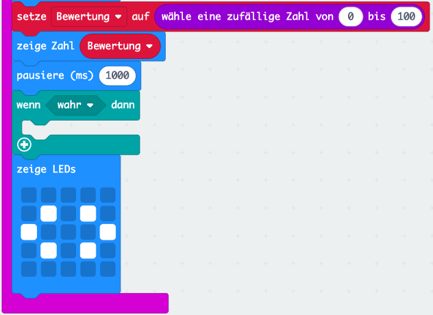
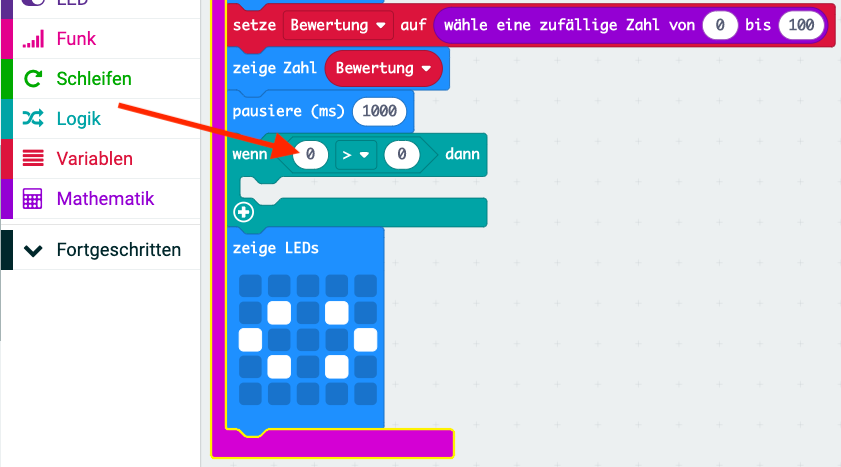
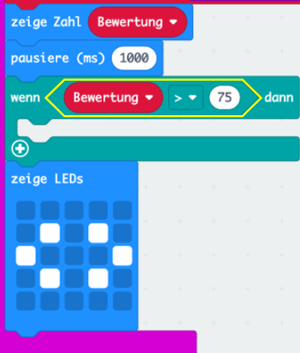
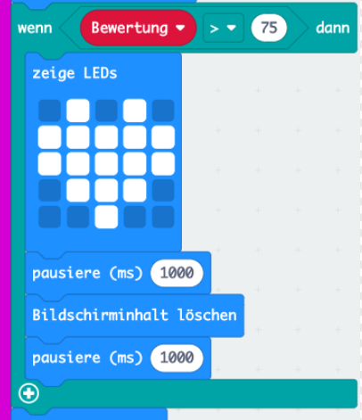

## Beste Freunde

Lass uns ein Herz zeigen, wenn zwei Freunde eine hohe Bewertung haben.

+ Füge deinem Code einen `wenn`-Block hinzu, kurz bevor die Anweisungen angezeigt werden.

+ Du möchtest ein Herz anzeigen, wenn die Bewertung hoch ist (z. B. über 75). Ziehe dazu einen Vergleichsblock von 'Logik' auf 'Wenn' und wähle '>':

+ Ziehe deine Variable `Bewertung` auf die linke Seite deines `wenn`-Blocks, und füge die Zahl `75` auf der rechten Seite hinzu.

Jeder Code in diesem `wenn`-Block wird ausgeführt, wenn die Bewertung über 75 liegt.

+ Zeige 1 Sekunde lang ein Herzbild auf dem Bildschirm an, wenn die Bewertung über 75 liegt.

+ Teste deinen Code. Wird ein Bild eines Herzens angezeigt, wenn die Bewertung über 75 liegt? Möglicherweise musst du es einige Male versuchen um es zu testen!