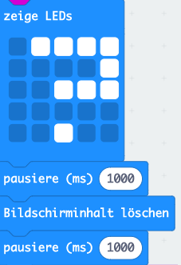
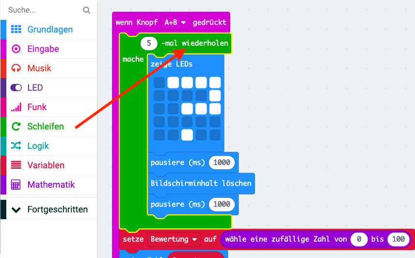

## Hinzufügen einer Animation

Lass uns kurze Animationen in deinem Programm anzeigen.

+ Hier ist der Code zum Anzeigen eines Fragezeichens für 1 Sekunde, bevor der Bildschirm gelöscht wird:

+ Damit dieses Fragezeichen fünfmal blinkt, musst du diesen Code in eine `Wiederholungs-`Schleife einfügen und die Anzahl der Wiederholungen auf '5' setzen:

