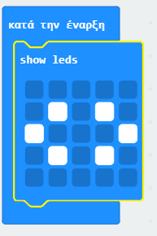
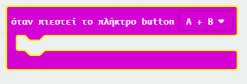
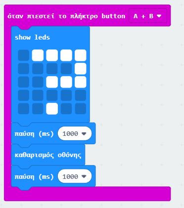

## Πατώντας κουμπιά μαζί

Ας ξεκινήσουμε το πρόγραμμά σου, όταν πατηθούν μαζί τα κουμπιά A και B.

+ Πήγαινε στο <a href="https://rpf.io/microbit-new" target="_blank">rpf.io/microbit-new</a> για να ξεκινήσεις ένα νέο έργο στον επεξεργαστή MakeCode (PXT). Ονόμασε το νέο σου έργο 'Βαθμός Φιλίας'.

+ Όταν ξεκινά το micro:bit, εμφάνισε μια εικόνα που δείχνει ότι και τα δύο κουμπιά πρέπει να πατηθούν.

Μπορείς να χρησιμοποιήσεις την κύλιση κειμένου αντί για μια εικόνα αν προτιμάς.

+ Μια βαθμολογία δεν θα πρέπει να εμφανίζεται μέχρι να **πατηθούν και τα δύο πλήκτρα**. Πρόσθεσε ένα νέο συμβάν στο έργο σου `με πατημένα τα κουμπιά A+B`.

+ Πρόσθεσε κώδικα για να εμφανίσεις ένα ερωτηματικό για 1 δευτερόλεπτο, για να δημιουργήσεις αγωνία πριν δώσεις στους φίλους την αξιολόγησή τους.

+ Δοκίμασε τον κώδικά σου. Όταν πατάς τα πλήκτρα **A και B μαζί**, θα πρέπει να αναβοσβήνει ένα ερωτηματικό στην οθόνη.

