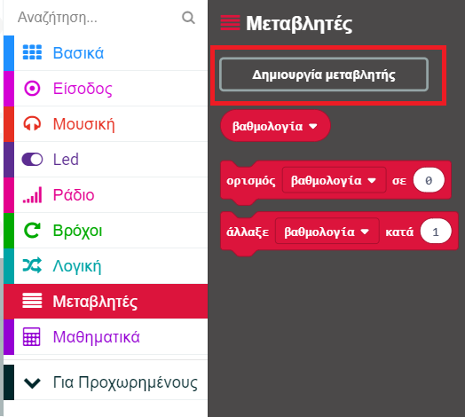
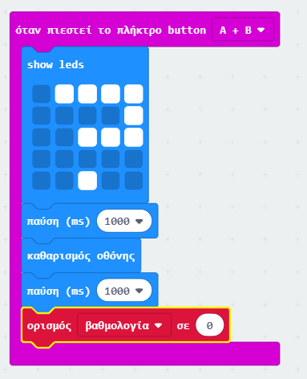
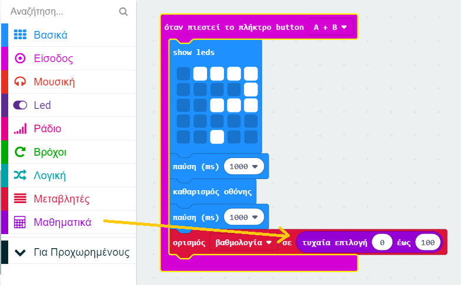
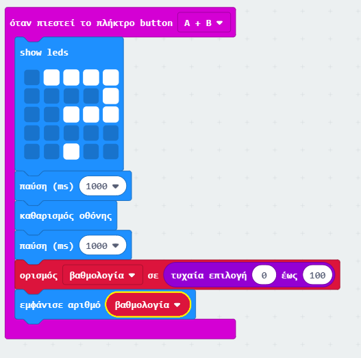
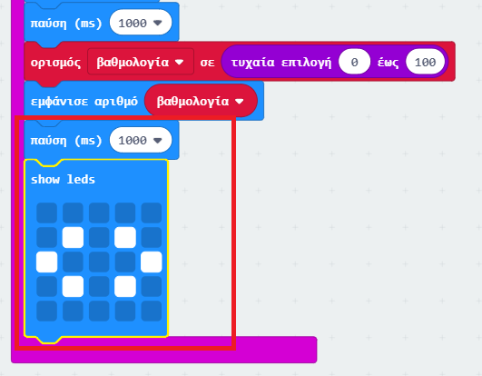

## Προβολή μιας βαθμολογίας

Εμφάνισε μια βαθμολογία φιλίας στην οθόνη.

+ Κάνε κλικ στις 'Μεταβλητές' και φτιάξε μια νέα μεταβλητή με την ονομασία `βαθμολογία`.

+ Σύρε ένα μπλοκ `set` στο τέλος του κώδικα `μετά το πάτημα των κουμπιών A+B` και επίλεξε τη μεταβλητή `βαθμολογία`:

+ Κάνε κλικ στο 'Αριθμοί' και χρησιμοποίησε το μπλοκ `τυχαία επιλογή` για να ορίσεις τη βαθμολογία σε τυχαίο αριθμό μεταξύ 0 και 100.

+ Πρόσθεσε τον κώδικα για να εμφανιστεί η βαθμολογία στην οθόνη.

+ Τέλος, μετά από μια καθυστέρηση, εμφάνισε ξανά τις οδηγίες. Να θυμάσαι ότι μπορείς να χρησιμοποιήσεις το δεξί κλικ και στη συνέχεια το 'Αντίγραφο' για να αντιγράψεις ένα μπλοκ.

+ Δοκίμασε τον κώδικά σου. Τώρα, αν πατήσεις ταυτόχρονα τα κουμπιά Α και Β, μία τυχαία βαθμολογία θα πρέπει να εμφανιστεί.