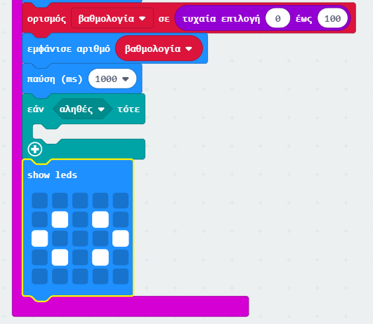
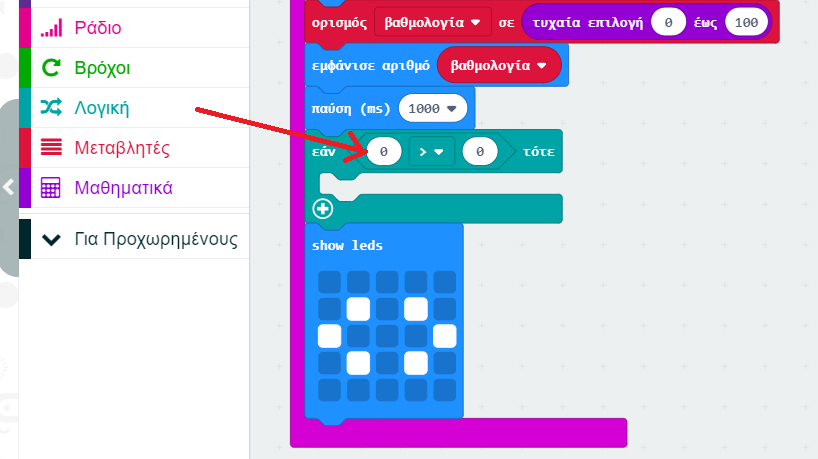
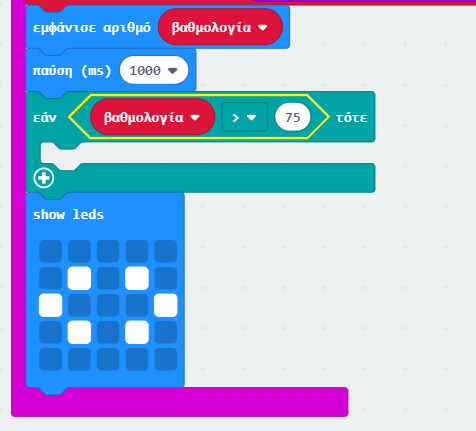
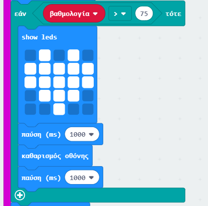

## Οι καλύτεροι φίλοι

Ας εμφανίσουμε μια καρδιά όταν δύο φίλοι έχουν υψηλή βαθμολογία.

+ Πρόσθεσε στον κώδικά σου ένα μπλοκ `if`, λίγο πριν την εμφάνιση των οδηγιών.

+ Θέλεις να εμφανίσεις μια καρδιά εάν η βαθμολογία είναι υψηλή (ας πούμε πάνω από 75). Για να το κάνεις αυτό, σύρε ένα μπλοκ σύγκρισης από το 'Λογική' στο 'if' και επίλεξε '>':

+ Σύρε τη μεταβλητή με τη `βαθμολογία` σου στην αριστερή πλευρά από το μπλοκ `if` και πρόσθεσε τον αριθμό `75` στη δεξιά πλευρά.

Οποιοσδήποτε κώδικας βρίσκεται μέσα σε αυτό το μπλοκ `if` θα εκτελεστεί αν η βαθμολογία είναι πάνω από 75.

+ Εμφάνισε μια εικόνα καρδιάς στην οθόνη για 1 δευτερόλεπτο αν η βαθμολογία είναι πάνω από 75.

+ Δοκίμασε τον κώδικά σου. Εμφανίζεται η εικόνα μιας καρδιάς αν η βαθμολογία είναι πάνω από 75; Ίσως χρειαστεί να δοκιμάσεις μερικές φορές για να το πετύχεις!