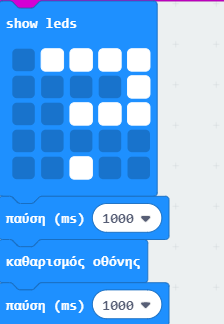
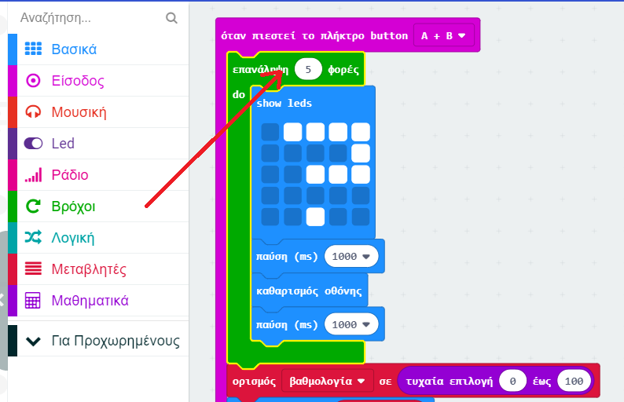

## Προσθήκη κινούμενης εικόνας

Ας προβάλουμε σύντομες κινούμενες εικόνες στο πρόγραμμά σου.

+ Ακολουθεί ο κώδικας για την εμφάνιση ενός ερωτηματικού για 1 δευτερόλεπτο πριν από την εκκαθάριση της οθόνης:

+ Για να κάνεις αυτό το ερωτηματικό να αναβοσβήσει 5 φορές, θα χρειαστεί να τοποθετήσεις αυτόν τον κώδικα σε ένα βρόχο `επανάληψης` και να ορίσεις τον αριθμό επαναλήψεων στο '5':

