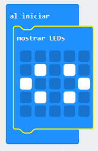
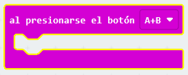
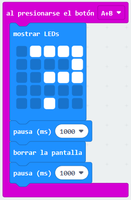

## Presionar ambas teclas juntas

Vamos a iniciar el programa cuando las teclas A y B se presionen juntas.

+ Ve a <a href="https://rpf.io/microbit-new" target="_blank">rpf.io/microbit-new</a> para comenzar un nuevo proyecto en el editor MakeCode (PXT). Llama a tu nuevo proyecto "Califica a tus compañeros".

+ Cuando inicies el micro:bit, muestra una imagen en donde se vea que ambas teclas deben presionarse.

Puedes usar un texto desplazable en lugar de una imagen si así lo prefieres.

+ La calificación no debería mostrarse hasta que **ambas teclas sean presionadas**. Agrega un nuevo evento a tu proyecto `al presionarse el botón A+B`.

+ Añade algún código que muestre un signo de interrogación durante 1 segundo, y así crear suspenso antes de darle a los amigos su calificación.

+ Prueba tu código. Cuando presiones las teclas **A y B juntas**, un signo de interrogación debería aparecer en la pantalla.

