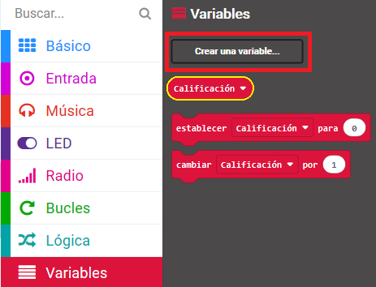

## Mostrar una calificación

Muestra una calificación de amistad en la pantalla.

+ Haz clic en "Variables" y crea una nueva variable llamada `calificación`.

+ Arrastra el bloque `establecer` al final de tu código `al presionar el botón A+B` y selecciona la variable `calificación`:

+ Haz clic en "Matemática" y usa el bloque `escoger al azar` para establecer la calificación de un número al azar entre 0 y 100.

+ Agrega código para mostrar la calificación en la pantalla.

+ Por último, luego de una demora, vuelva a mostrar las instrucciones. Recuerda que puedes usar el botón derecho y luego 'Duplicar' para copiar un bloque.

+ Prueba tu código. Ahora, si presionas los botones A y B juntas, se debería mostrar una calificación aleatoria.