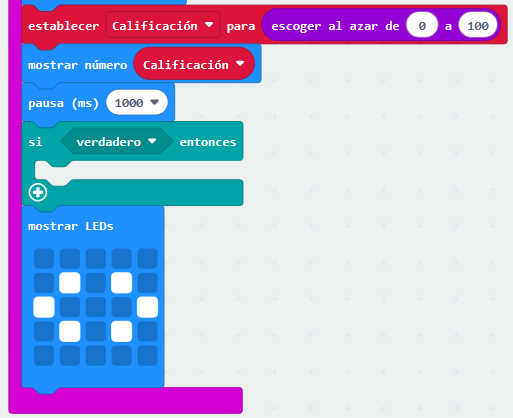
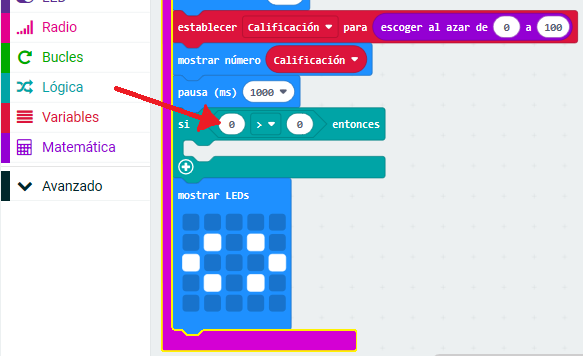
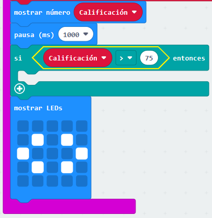
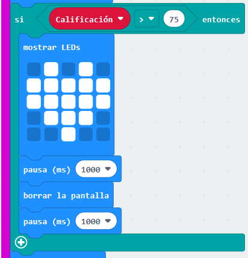

## Mejores compañeros

Vamos a mostrar un corazón cuando dos amigos tengan una calificación alta.

+ Agregue un bloque `si` a tu código, justo antes de que se muestren las instrucciones.

+ Querrás mostrar un corazón si la calificación es alta (digamos, más de 75). Para hacerlo, arrastra un bloque de comparación de "Lógica" a tu "si" y selecciona ">":

+ Arrastra tu variable `calificación` al lado izquierdo de tu bloque `si`, y agrega el número `75` al lado derecho.

Cualquier código dentro del bloque `si` se ejecutará si la calificación es superior a 75.

+ Muestra una imagen de corazón en la pantalla durante 1 segundo si la calificación es superior a 75.

+ Prueba tu código. ¿Se muestra la imagen de un corazón si la calificación es superior a 75? ¡Puede ser que tengas que intentarlo varias veces para probarlo!