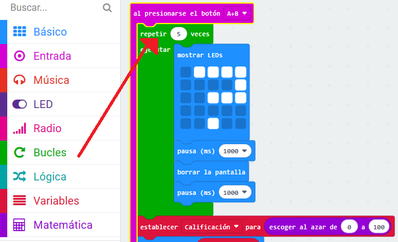

## Agregar una animación

Vamos a mostrar animaciones cortas en tu programa.

+ Aquí está el código para mostrar un signo de interrogación durante 1 segundo antes de borrar la pantalla:

+ Para hacer que este signo de interrogación parpadee 5 veces, deberás colocar este código dentro del bucle `repetir` y establecer el número de repeticiones a "5":

