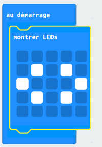
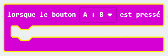
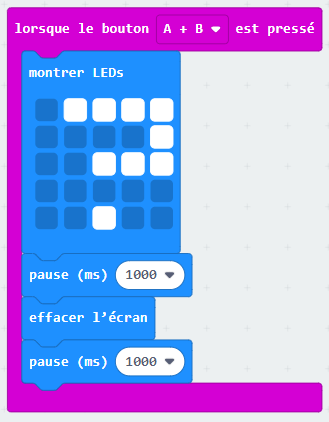
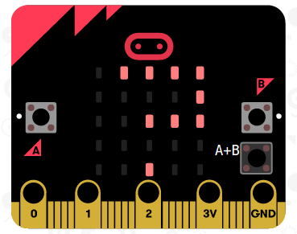

## Appuyer sur les deux boutons ensemble

Commençons le programme quand les boutons A et B sont pressés ensemble.

+ Va sur <a href="http://jumpto.cc/pxt-new" target="_blank">jumpto.cc/pxt-new</a> pour démarrer un nouveau projet dans l'éditeur PXT.
  Appelle ton nouveau projet 'Note tes potes'.

+ Quand la micro:bit démarre, affiche une image pour montrer que les deux boutons doivent être pressés simultanément.

Tu peux utiliser du texte qui défile ou bien une image si tu préfères.

+ Une note ne doit pas être affichée tant que __les deux boutons sont pressés__.
  Ajouter un événement `lorsque le bouton A+B est pressé` dans ton projet.

+ Ajoute le code pour afficher un point d'interrogation pendant 1 seconde, pour faire durer le suspense avant de révéler aux amis la force de leur amitié.

+ Teste ton code.
  Quand tu appuies sur les boutons __A et B ensemble__, un point d'interrogation devrait clignoter sur l'écran.

