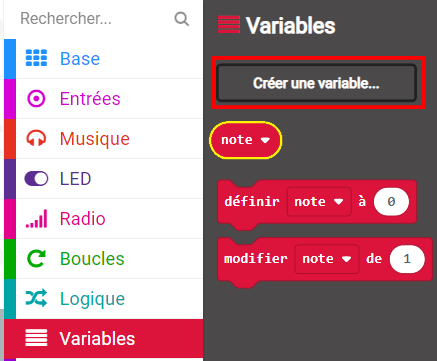

## Afficher la note

Affiche la force de l'amitié sur l'écran.

+ Clique sur 'Variables' et ajoute une variable appelée `amitié`.

+ Ajoute un bloc `définir ... à` à la fin du bloc `lorsque le bouton A+B est pressé` est sélectionne la variable `amitié`&nbsp;:

+ Clique sur 'Math', et utilise un bloc `choisir au hasard entre 0 et ...` pour définir l'amitié, en prenant un nombre aléatoire entre 0 et 100.

+ Ajoute le code pour afficher l'`amitié` sur l'écran.

+ Enfin, après un délai, affiche les instructions à nouveau.
  Souviens-toi que tu peux utiliser le clic-droit puis 'Dupliquer' pour copier un bloc.

+ Teste ton code. Maintenant, si tu presses les boutons A et B ensemble, un nombre au hasard devrait s'afficher.
