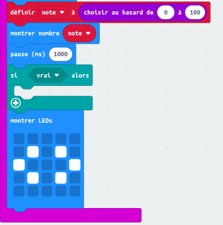
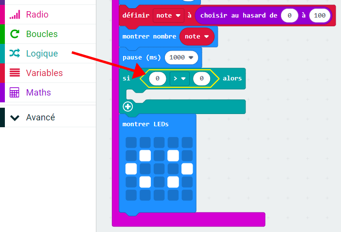
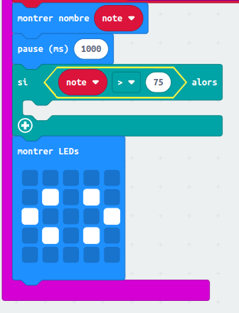
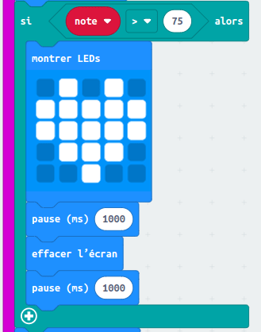

## Les meilleurs potes

Affichons un coeur quand deux amis ont une grande amitié.

+ Ajoute un bloc de code `si` dans code, juste avant l'affichage des instructions.

+ Tu veux afficher un coeur si l'`amitié` est est grande (disons supérieure à 75).
  Pour cela, dans 'Logique' prend un bloc de comparaison et met le dans ton `si`, puis sélectionne '>'&nbsp;:

+ Place la variable `amitié` dans le partie gauche de ton bloc `si`, et mets le nombre `75` dans la partie droite.

Le code à l'intérieur du bloc `si` ne s'exécutera que si l'`amitié` est supérieure à 75.

+ Affiche une image avec coeur sur l'écran pendant 1 seconde si l'`amitié` est supérieure à 75.

+ Teste ton code.
  Est-ce qu'une image de coeur apparaît si l'`amitié` est supérieure à 75&nbsp;?
  Tu peux essayer plusieurs fois pour tester&nbsp;!
