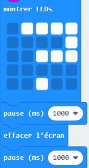
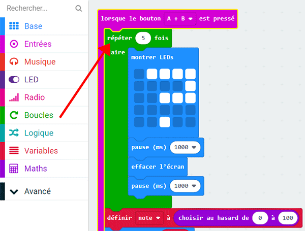

## Ajouter des animations

Ajoute de petites animations dans ton programme.

+ Voici le code pour afficher un point d'interrogation pendant 1 seconde avant d'effacer l'écran&nbsp;:

+ Pour faire clignoter ce point d'interrogation 5 fois, tu devras mettre ce code à l'intérieur d'une boucle `répéter` et régler le nombre de répétition à 5.

