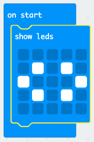

## बटन एक साथ दबाना

आइए आपका प्रोग्राम शुरू करते हैं जब A और B बटन एक साथ दबाए जाते हैं।

+ Go to <a href="https://rpf.io/microbit-new" target="_blank">rpf.io/microbit-new</a> to start a new project in the MakeCode (PXT) editor. अपने नए प्रोजेक्ट का नाम 'अपने साथी को रेट करें' रखें।

+ जब micro:bit शुरू होता है, तो यह दर्शाने के लिए एक छवि दिखाएँ कि दोनों बटन दबाए जाने चाहिए।

यदि आप चाहें तो आप छवि के बजाय स्क्रॉलिंग टेक्स्ट का उपयोग कर सकते हैं।

+ कोई रेटिंग तभी दिखाई जानी चाहिए जब **दोनों बटन दबाए जाएँ** उसके बिना नहीं। अपने प्रोजेक्ट में एक नया इवेंट `on button A+B pressed` (बटन A+B दबाए जाने पर) जोड़ें।

+ दोस्तों को अपनी रेटिंग देने से पहले रहस्य बनाए रखने के लिए 1 सेकंड के लिए एक प्रश्न चिह्न दिखाने के लिए कोड जोड़ें।

+ अपने कोड का परीक्षण करें। जब आप बटन **A और B एक साथ** दबाते हैं, तो स्क्रीन पर एक प्रश्न चिह्न फ्लैश होना चाहिए।

