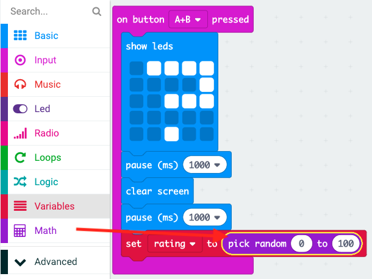

## रेटिंग प्रदर्शित करना

स्क्रीन पर दोस्ती की रेटिंग दिखाएँ।

+ 'वेरिएबल्स' पर क्लिक करें और `रेटिंग` नाम का एक नया वेरिएबल बनाएँ।

+ एक `set` (सेट करें) ब्लॉक को अपने `on button A+B pressed` (बटन A+B दबाए जाने पर) कोड के अंत तक ड्रैग करें और `रेटिंग` वेरिएबल का चयन करें:

+ 'Math' (मैथ) पर क्लिक करें, और रेटिंग को 0 और 100 के बीच की किसी यादृच्छिक संख्या पर सेट करने के लिए `pick random` (यादृच्छिक चुनें) ब्लॉक का उपयोग करें।

+ स्क्रीन पर रेटिंग दिखाने के लिए कोड जोड़ें।

+ अंत में, कुछ विलंब के बाद, निर्देशों को फिर से प्रदर्शित करें। याद रखें कि आप किसी ब्लॉक को कॉपी करने के लिए राइट-क्लिक करके 'Duplicate' (डुप्लीकेट) का उपयोग कर सकते हैं।

+ अपने कोड का परीक्षण करें। अब, यदि आप बटन A और B को एक साथ दबाते हैं, तो एक यादृच्छिक रेटिंग प्रदर्शित होनी चाहिए।