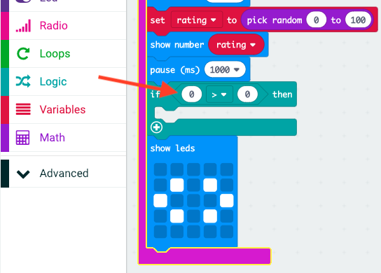

## सर्वश्रेष्ठ साथी

आइए जब दो दोस्तों की उच्च रेटिंग हो तो एक दिल प्रदर्शित करें।

+ निर्देशों को दिखाए जाने से ठीक पहले, अपने कोड पर एक `if` (यदि) ब्लॉक जोड़ें।

+ यदि रेटिंग उच्च है (मानो 75 से अधिक है) तो आप दिल प्रदर्शित करना चाहते हैं। ऐसा करने के लिए, 'Logic' (तर्क) से तुलनात्मक ब्लॉक को अपने 'if' (यदि) पर खींचें और '>' चुनें:

+ अपने `रेटिंग` वेरिएबल को अपने `if` (यदि) ब्लॉक के बाईं तरफ खींचें, और दाईं तरफ संख्या `75` जोड़ें।

यदि रेटिंग 75 से अधिक होगी तो इस `if` (यदि) ब्लॉक के अंदर जो भी कोड होगा वह चलेगा।

+ यदि रेटिंग 75 से अधिक हो तो स्क्रीन पर 1 सेकंड के लिए दिल की छवि दिखाएँ।

+ अपने कोड का परीक्षण करें। यदि रेटिंग 75 से अधिक है तो क्या दिल की कोई छवि दिखती है? आपको इसका परीक्षण करने के लिए कुछ बार कोशिश करनी पड़ सकती है!