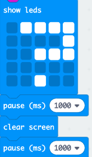

## एनिमेशन जोड़ना

आइए हम आपके प्रोग्राम में छोटे एनिमेशन प्रदर्शित करें।

+ स्क्रीन साफ़ करने से पहले 1 सेकंड के लिए प्रश्न चिह्न प्रदर्शित करने के लिए कोड यहाँ दिया गया है:

+ इस प्रश्न चिह्न को 5 बार फ्लैश करने के लिए, आपको इस कोड को `repeat` (दोहराएँ) लूप के अंदर रखना होगा और दोहराए जाने की संख्या को '5' पर सेट करना होगा:

