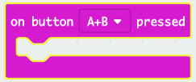

## ಗುಂಡಿ(button) ಗಳನ್ನು ಒಟ್ಟಿಗೆ ಒತ್ತುವುದು

A ಮತ್ತು B ಗುಂಡಿಗಳನ್ನು ಒಟ್ಟಿಗೆ ಒತ್ತಿದಾಗ ನಿಮ್ಮ ಪ್ರೋಗ್ರಾಂ ಅನ್ನು ಪ್ರಾರಂಭಿಸೋಣ.

+ MakeCode (PXT) ಸಂಪಾದಕದಲ್ಲಿ ಹೊಸ ಪ್ರಾಜೆಕ್ಟ್ ಅನ್ನು ಪ್ರಾರಂಭಿಸಲು <a href="https://rpf.io/microbit-new" target="_blank">rpf.io/microbit-new</a>ಗೆ ಹೋಗಿ. ನಿಮ್ಮ ಹೊಸ ಪ್ರಾಜೆಕ್ಟ್ ಅನ್ನು 'Rate Your Mates' ಎಂದು ಕರೆಯಿರಿ.

+ Micro:bit ಪ್ರಾರಂಭವಾದಾಗ, ಎರಡೂ ಗುಂಡಿಗಳನ್ನು ಒತ್ತಬೇಕು ಎಂದು ತೋರಿಸುವ ಚಿತ್ರವನ್ನು ಪ್ರದರ್ಶಿಸಿ.

ನೀವು ಬಯಸಿದಲ್ಲಿ ಚಿತ್ರದ ಬದಲು ಸ್ಕ್ರೋಲಿಂಗ್ ಪಠ್ಯವನ್ನು ಬಳಸಬಹುದು.

+ **ಎರಡೂ ಗುಂಡಿಗಳನ್ನು ಒತ್ತುವವರೆಗೆ** ರೇಟಿಂಗ್ ಅನ್ನು ತೋರಿಸಬಾರದು. `ಎ + ಬಿ ಒತ್ತಿದ` ಎಂಬ ಹೊಸ ಈವೆಂಟ್ಟನ್ನು ನಿಮ್ಮ ಪ್ರಾಜೆಕ್ಟ್ ಗೆ ಸೇರಿಸಿ.

+ ಸ್ನೇಹಿತರಿಗೆ ಅವರ ರೇಟಿಂಗ್ ನೀಡುವ ಮೊದಲು ಸಸ್ಪೆನ್ಸ್ ನಿರ್ಮಿಸಲು, 1 ಸೆಕೆಂಡಿಗೆ ಪ್ರಶ್ನಾರ್ಥಕ ಚಿಹ್ನೆಯನ್ನು ತೋರಿಸಲು ಕೋಡ್ ಸೇರಿಸಿ.

+ ನಿಮ್ಮ ಕೋಡ್ ಅನ್ನು ಪರೀಕ್ಷಿಸಿ. ನೀವು **ಎ ಮತ್ತು ಬಿ ಗುಂಡಿಗಳನ್ನು ಒಟ್ಟಿಗೆ** ಒತ್ತಿದಾಗ, ಪ್ರಶ್ನಾರ್ಥಕ ಚಿಹ್ನೆಯು ಪರದೆಯ ಮೇಲೆ ಮಿಂಚಬೇಕು.

