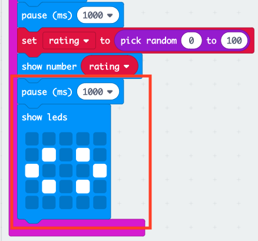

## ರೇಟಿಂಗ್ ಪ್ರದರ್ಶಿಸುವುದು

ಸ್ನೇಹದ ರೇಟಿಂಗ್ ಅನ್ನು ಪರದೆಯ ಮೇಲೆ ತೋರಿಸಿ.

+ 'Variables' ಕ್ಲಿಕ್ ಮಾಡಿ ಮತ್ತು `rating` ಎಂಬ ಹೊಸ ವೇರಿಯಬಲ್ ಮಾಡಿ.

+ `set` ಬ್ಲಾಕ್ ಅನ್ನು ನಿಮ್ಮ `on button A+B pressed` ಕೋಡ್ ನ ಕೊನೆಯವರೆಗೂ ಎಳೆಯಿರಿ ಮತ್ತು `rating` ವೇರಿಯಬಲ್ ಆಯ್ಕೆಮಾಡಿ:

+ 'Math' ಕ್ಲಿಕ್ ಮಾಡಿ, ಮತ್ತು `pick random` ಬ್ಲಾಕ್ ಬಳಸಿ ರೇಟಿಂಗ್ ಅನ್ನು 0 ಮತ್ತು 100 ರ ನಡುವೆ ರೆಂಡಮ್ ಸಂಖ್ಯೆಗೆ ಹೊಂದಿಸಿ.

+ ರೇಟಿಂಗ್ ಅನ್ನು ಪರದೆಯ ಮೇಲೆ ತೋರಿಸಲು ಕೋಡ್ ಸೇರಿಸಿ.

+ ಅಂತಿಮವಾಗಿ, ವಿಳಂಬದ ನಂತರ, ಸೂಚನೆಗಳನ್ನು ಮತ್ತೆ ಪ್ರದರ್ಶಿಸಿ. ನೆನಪಿಡಿ ಬ್ಲಾಕ್ ಅನ್ನು ನಕಲಿಸಲು ನೀವು ಬಲ-ಕ್ಲಿಕ್ ಮಾಡಿ ನಂತರ 'Duplicate' ಅನ್ನು ಬಳಸಬಹುದು.

+ ನಿಮ್ಮ ಕೋಡ್ ಅನ್ನು ಪರೀಕ್ಷಿಸಿ. ಈಗ, ನೀವು A ಮತ್ತು B ಗುಂಡಿಗಳನ್ನು ಒಟ್ಟಿಗೆ ಒತ್ತಿದರೆ, ಯಾವುದಾದರೊಂದು ರೇಟಿಂಗ್ ಅನ್ನು ಪ್ರದರ್ಶಿಸಬೇಕು.