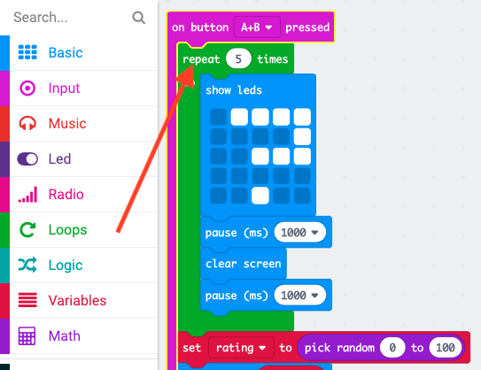

## ಅನಿಮೇಷನ್ ತೋರಿಸುವುದು

ನಿಮ್ಮ ಪ್ರೋಗ್ರಾಂನಲ್ಲಿ ಸಣ್ಣ ಅನಿಮೇಷನ್ ಗಳನ್ನು ಪ್ರದರ್ಶಿಸೋಣ.

+ ಪರದೆಯನ್ನು ತೆರವುಗೊಳಿಸುವ ಮೊದಲು 1 ಸೆಕೆಂಡಿಗೆ ಪ್ರಶ್ನಾರ್ಥಕ ಚಿಹ್ನೆಯನ್ನು ಪ್ರದರ್ಶಿಸುವ ಕೋಡ್ ಇಲ್ಲಿದೆ:

+ ಪ್ರಶ್ನಾರ್ಥಕ ಚಿಹ್ನೆಯನ್ನು 5 ಬಾರಿ ಫ್ಲ್ಯಾಷ್ ಮಾಡಲು, ನೀವು ಈ ಕೋಡ್ ಅನ್ನು `repeat` ಲೂಪ್ ಒಳಗೆ ಸೇರಿಸಿ ಮತ್ತು ಪುನರಾವರ್ತನೆಗಳ ಸಂಖ್ಯೆಯನ್ನು '5' ಗೆ ಹೊಂದಿಸಿ:

