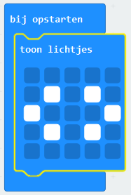
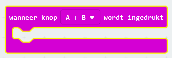
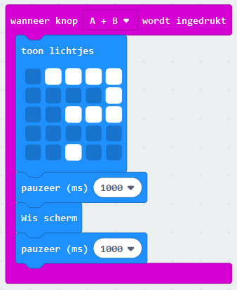

## Knoppen gelijktijdig indrukken

Laten we je programma starten wanneer de A- en B-knoppen gelijktijdig worden ingedrukt.

+ Ga naar <a href="https://rpf.io/microbit-new" target="_blank">rpf.io/microbit-new</a> om een ​​nieuw project te starten in de MakeCode (PXT) editor. Noem je nieuwe project 'Beoordeel je vrienden'.

+ Wanneer de micro:bit opstart, toon een afbeelding die laat zien dat beide knoppen moeten worden ingedrukt.

Je kunt scrollende tekst gebruiken in plaats van een afbeelding als je wilt.

+ Een beoordeling moet niet worden weergegeven totdat **beide knoppen worden ingedrukt**. Voeg een nieuw `wanneer knop A+B wordt ingedrukt` gebeurtenis toe aan je project.

+ Voeg code toe om gedurende 1 seconde een vraagteken te tonen, om de spanning op te bouwen voordat de vrienden hun beoordeling krijgen.

+ Test je code. Wanneer je de knoppen **A en B samen indrukt**, zou een vraagteken om het scherm moeten knipperen.

