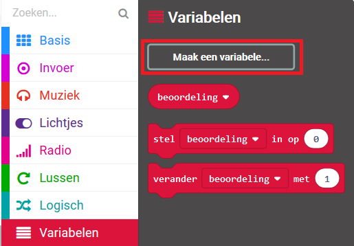
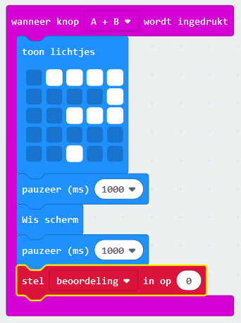
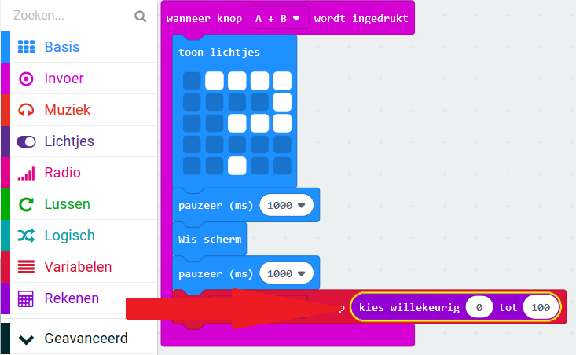
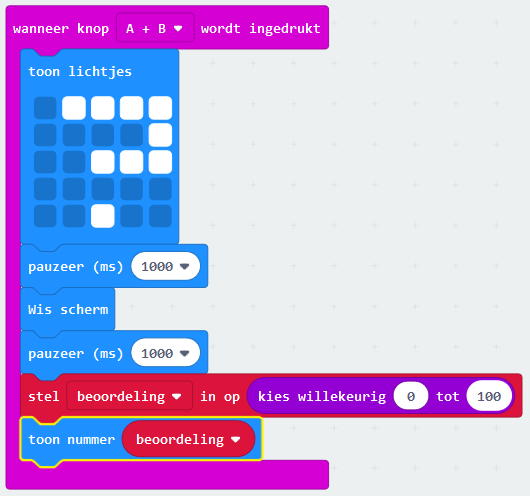
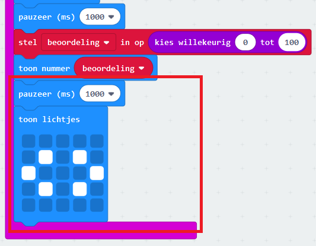

## Een beoordeling weergeven

Een vriendschapsbeoordeling op het scherm laten zien.

+ Klik op 'Variabelen' en maak een nieuwe variabele genaamd `beoordeling`.

+ Sleep een `stel in op` blok naar het einde van je `wanneer knop A+B wordt ingedrukt` code en selecteer de `beoordeling` variabele:

+ Klik op 'Rekenen', en gebruik het `kies willekeurig` blok om de beoordeling in te stellen op een willekeurig getal tussen 0 en 100.

+ Voeg code toe om de beoordeling op het scherm te tonen.

+ Toon tenslotte de instructies opnieuw, na enige vertraging. Vergeet niet dat je de rechtermuisklik kunt gebruiken om een blok te dupliceren.

+ Test je code. Als je knoppen A en B samen indrukt, moet een willekeurige beoordeling worden weergegeven.