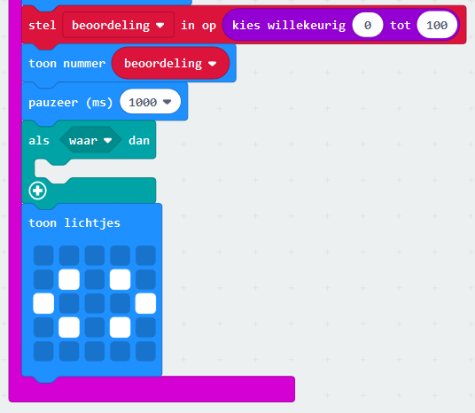
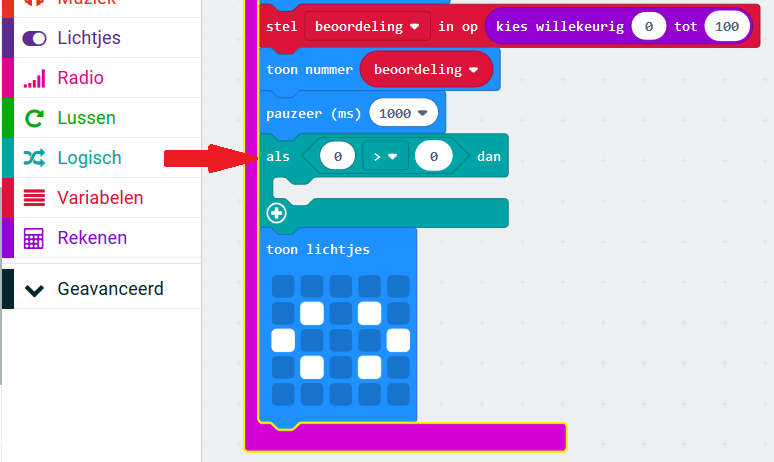
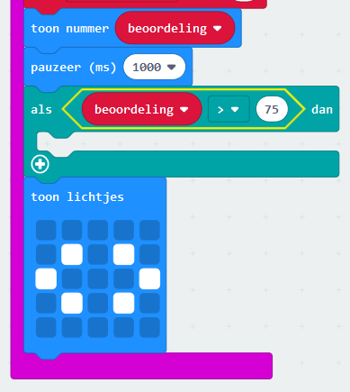
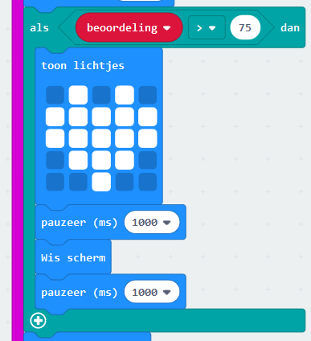

## Beste vrienden

Laten we een hart tonen wanneer twee vrienden een hoge beoordeling hebben.

+ Voeg een `als` blok toe aan je code, vlak voor de instructies worden getoond.

+ Je wilt een hart tonen als de beoordeling hoog is (laten we zeggen meer dan 75). Om dit te doen, sleep een vergelijkingsblok van "Logic" naar je "if" en selecteer '>':

+ Sleep je `beoordeling` variabele naar de linkerkant van je `als` blok, en voeg het getal `75` aan de rechterkant toe.

Elke code binnen dit `als` blok wordt uitgevoerd als de beoordeling boven 75 is.

+ Toon een afbeelding van een hart op het scherm gedurende 1 seconde als de beoordeling boven 75 is.

+ Test je code. Wordt een afbeelding van een hart weergegeven als de beoordeling hoger is dan 75? Je moet misschien een paar keer proberen om het uit te testen!