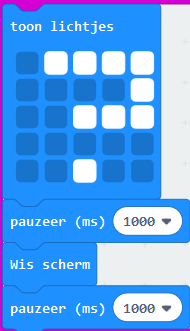
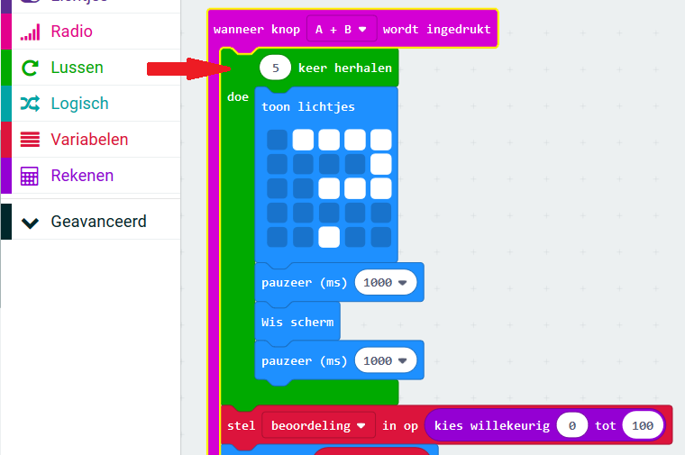

## Een animatie toevoegen

Laten we korte animaties in je programma tonen.

+ Hier is de code voor het tonen van een vraagteken gedurende 1 seconde voordat het scherm wordt gewist:

+ Om dit vraagteken 5 keer te laten knipperen, moet je deze code binnen een `keer herhalen` lus zetten en het aantal herhalingen instellen op '5':

