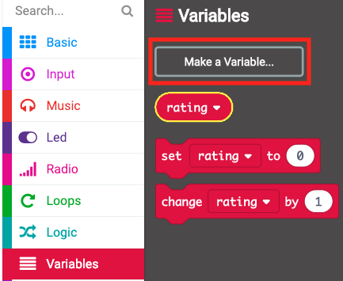

## Displaying a rating

Show a friendship rating on the screen.

+ Click 'Variables' and make a new variable called `rating`.

+ Drag a `set` block to the end of your `on button A+B pressed` code and select the `rating` variable:

+ Click 'Math', and use the `pick random` block to set the rating to a random number between 0 and 100.

+ Add code to show the rating on the screen.

+ Finally, after a delay, display the instructions again. Remember that you can use right-click then 'Duplicate' to copy a block.

+ Test your code. Now, if you press buttons A and B together, a random rating should be displayed.